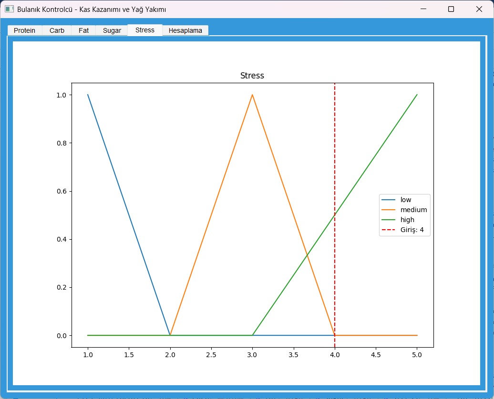

# Kas Gelişimi Ve Yağ Kaybı Tahmin Bulanık Kontrolcüsü

### Giriş
Bu kontrolcünün amacı; Protein, karbonhidrat, yağ ve şeker tüketiminizi ele alarak yağ yıkımı ve kas gelişimi miktarını 10 üzerinden puanlayarak tahmin etmektir.
#### İlgili durumlar için 25 adet kural belirlenmiştir. Gerçekleşmesi imkansız bazı durumlar için bazı kurallar atlandı. Rastgele girişler yapıldığında ilgili uyarıyı almanız normaldir. Gerçekçi bir senaryoda gerçeğe oldukça yakın tahminler yapılabilmektedir.

### Üyelik Fonksiyonları
#### Protein:
###### düşük (0-100), orta (50-250), yüksek (200-300)

<p align="center">
  
</p>

#### Karbonhidrat:
###### düşük (0-100), orta (50-250), yüksek (200-300)

<p align="center">
  
</p>

#### Yağ:
###### düşük (0-100), orta (50-250), yüksek (200-300)

<p align="center">
  
</p>

#### Şeker:
###### düşük (0-30), orta (20-80), yüksek (60-100)

<p align="center">
  
</p>

#### Antrenman Stresi:
###### düşük (1-2), orta (2-4), yüksek (3-5)

<p align="center">
  
</p>

#### Kas Kazanımı:
###### çok düşük (0-2), düşük (1-5), orta (4-7), yüksek (6-9), çok yüksek (8-10)

#### Yağ Yakımı:
###### çok düşük (0-2), düşük (1-5), orta (4-7), yüksek (6-9), çok yüksek (8-10)

<p align="center">
  
</p>


#### GIT ile çalıştırma rehberi

```bash
git clone https://github.com/BatuhancanN/py_fuzzy_logic_muscle_and_fat](https://github.com/BatuhancanN/py_fuzzy_logic_muscle_and_fat_analyzer
```

```bash
cd py_fuzzy_logic_muscle_and_fat
```

```bash
pip install -r requirements.txt
```

```bash
python fuzzy.py
```


###### Bu proje Batuhan CAN tarafından Bulanık Mantık dersi final projesi olarak geliştirilmiştir.


